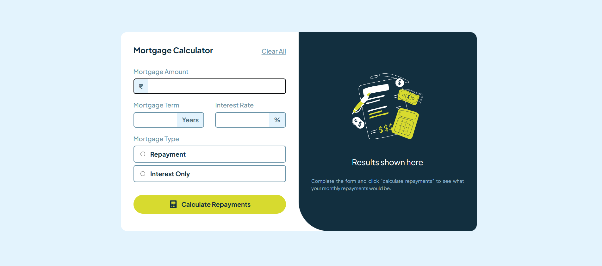

## Frontend Mentor - Mortgage Calculator Solution 🏠

[This is a solution to the Mortgage Calculator challenge on Frontend Mentor](https://www.frontendmentor.io/challenges/mortgage-repayment-calculator-Galx1LXK73)

A simple, responsive mortgage calculator built with **React** and **Tailwind CSS**.  
Users can input loan amount, term, interest rate, and select repayment type to calculate monthly repayments and total repayment amount.

## Screenshot

## 🔗 Links

- [Live Demo](https://mortgagecalculator-psi.vercel.app/)
- [Frontend Mentor Challenge](https://www.frontendmentor.io/challenges/mortgage-repayment-calculator-Galx1LXK73)

## 🛠️ Built With

- **React** – For building interactive UI components
- **Tailwind CSS** – Utility-first CSS framework for styling and responsive design
- **JavaScript (ES6+)** – For form handling, validation, and mortgage calculations

## ✅ Features

- Input validation with error messages for empty or invalid values
- Option to select mortgage type: **Repayment** or **Interest Only**
- Calculates **monthly repayment** and **total repayment** over the term
- **Clear All** button to reset the form and results
- Responsive layout suitable for mobile and desktop

## 🧠 What I Learned

- React state management with `useState` and `useEffect`
- Form validation logic and conditional rendering of error messages
- Mortgage calculation formulas for different repayment types
- Styling with Tailwind CSS including conditional classes
- Building user-friendly forms with accessible inputs and controls

## Author

- Coded by Md Ishan Ahmad
- GitHub - [ishanAh09](https://github.com/ishanah09)
